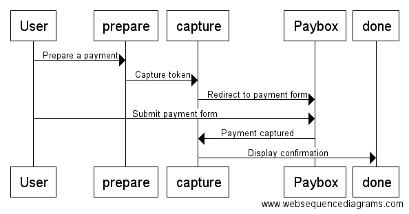

# Paybox extension for payum

This plugin is a payum extension to provide payment gateways for paybox payment system.
The plugin has been generated thanks to the payum composer Skeleton. 

For now, only Paybox system is supported. There is no gateway for paybox direct.

## Integration
### Test client
The client directory contains sample scripts to illustrate how the plugin should work.
Use a php server to serve prepare.php and it will guide you through a sample payment.

The client directory contains 4 scripts :
* config.php
* prepare.php
* capture.php
* done.php

#### config
Here you can provide you customer details provided by paybox :
* site
* rang
* identifiant
* hmac

Please refer to paybox documentation to know more about these params.
You can also configure sandbox option : if true, payment will be done in test environment.

#### prepare
This script contains the payment details : order number, currency, amount, ...
Please refer to paybox documentation to know more about these details and the values you can set.

#### capture
This script launch the payment capture.
With paybox system, capture is done on paybox website. So the capture action redirect the customer on paybox website where he has to provide his payment details (card number, ...). After payment details are submitted on paybox site, capture is done and user is redirected on done.php

#### done
This scripts acts as a payment confirmation. In this sample we just print payment details in json format.

### Integrate in your project
TODO

## Documentation
* [Documentation](src/Resources/docs/index.md)

## Resources

* [Payum Documentation](https://github.com/Payum/Payum/blob/master/src/Payum/Core/Resources/docs/index.md)
* [Paybox Documentation] (http://www1.paybox.com/)

## License

Payum-paybox is released under the [MIT License](LICENSE).
